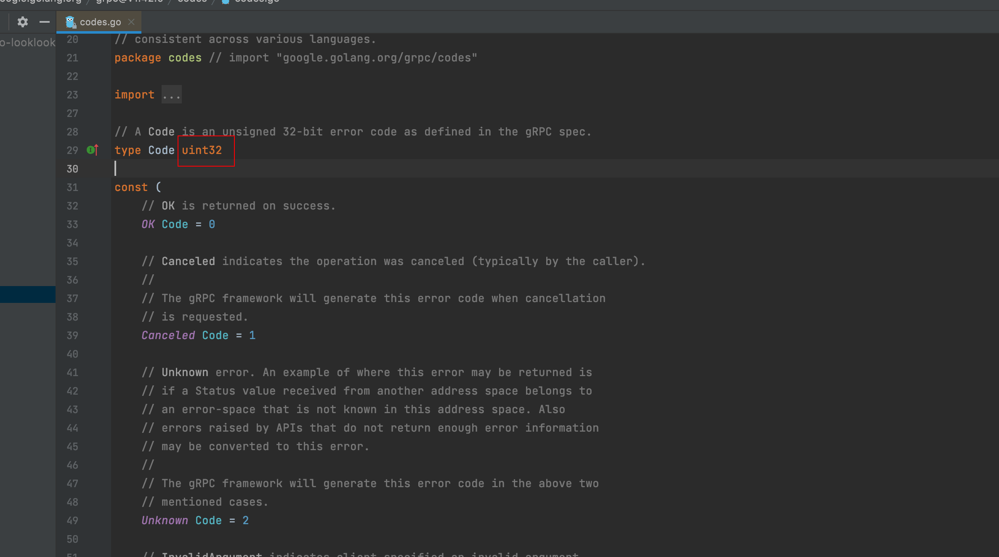
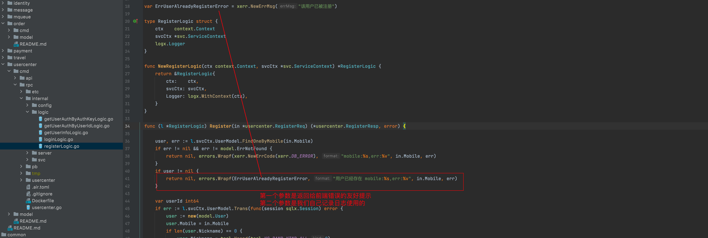
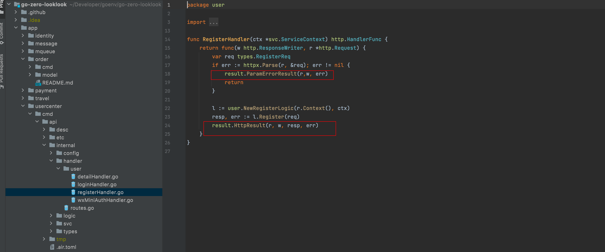
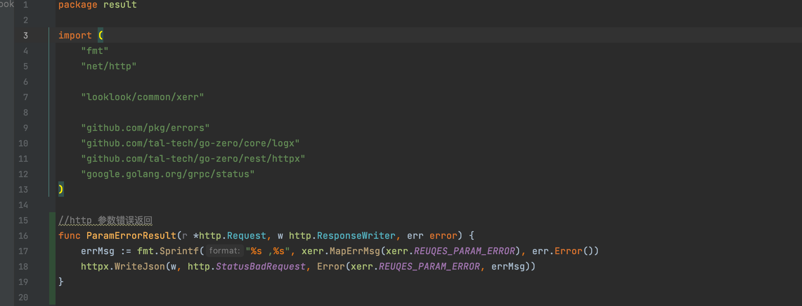
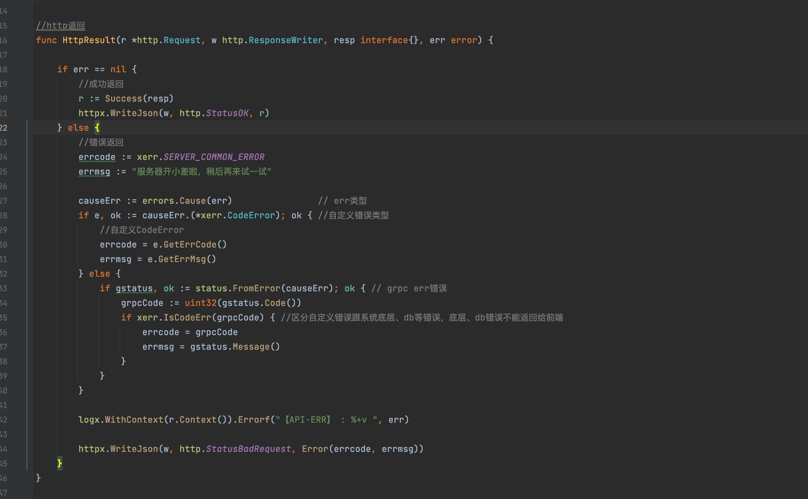

### 10、错误处理

本项目地址 :  https://github.com/Mikaelemmmm/go-zero-looklook


#### 1、概述

我们在平时开发时候，程序在出错时，希望可以通过错误日志能快速定位问题（那么传递进来的参数、包括堆栈信息肯定就要都要打印到日志），但同时又想返回给前端用户比较友善、能看得懂的错误提示，那这两点如果只通过一个fmt.Error、errors.new等返回一个错误信息肯定是无法做到的，除非在返回前端错误提示的地方同时在记录log，这样的话日志满天飞，代码难看不说，日志到时候也会很难看。

那么我们想一下，如果有一个统一的地方记录日志，同时在业务代码中只需要一个return err 就能将返回给前端的错误提示信息、日志记录相信信息分开提示跟记录，如果按照这个思路实现，那简直不要太爽，是的 go-zero-looklook就是这么处理的，接下来我们看下。


#### 2、rpc错误处理

按照正常情况下，go-zero的rpc服务是基于grpc的，默认返回的错误是grpc的status.Error 没法给我们自定义的错误合并，并且也不适合我们自定义的错误，它的错误码、错误类型都是定义死在grpc包中的，ok ，如果我们在rpc中能用自定义错误返回，然后在拦截器统一返回时候转成grpc的status.Error  ， 那么我们rpc的err跟api的err是不是可以统一管理我们自己的错误了呢？

我们看一下grpc的status.Error的code里面是什么



grpc的err对应的错误码其实就是一个uint32 ， 我们自己定义错误用uint32然后在rpc的全局拦截器返回时候转成grpc的err，就可以了

所以我们自己定义全局错误码在app/common/xerr

errCode.go

```go
package xerr

//成功返回
const OK uint32 = 200

/**(前3位代表业务,后三位代表具体功能)**/

//全局错误码
const SERVER_COMMON_ERROR uint32 = 100001
const REUQES_PARAM_ERROR uint32 = 100002
const TOKEN_EXPIRE_ERROR uint32 = 100003
const TOKEN_GENERATE_ERROR uint32 = 100004
const DB_ERROR uint32 = 100005

//用户模块
```

errMsg.go

```go
package xerr

var message map[uint32]string

func init() {
   message = make(map[uint32]string)
   message[OK] = "SUCCESS"
   message[SERVER_COMMON_ERROR] = "服务器开小差啦,稍后再来试一试"
   message[REUQES_PARAM_ERROR] = "参数错误"
   message[TOKEN_EXPIRE_ERROR] = "token失效，请重新登陆"
   message[TOKEN_GENERATE_ERROR] = "生成token失败"
   message[DB_ERROR] = "数据库繁忙,请稍后再试"
}

func MapErrMsg(errcode uint32) string {
   if msg, ok := message[errcode]; ok {
      return msg
   } else {
      return "服务器开小差啦,稍后再来试一试"
   }
}

func IsCodeErr(errcode uint32) bool {
   if _, ok := message[errcode]; ok {
      return true
   } else {
      return false
   }
}
```

errors.go

```go
package xerr

import (
   "fmt"
)

/**
常用通用固定错误
*/

type CodeError struct {
   errCode uint32
   errMsg  string
}

//返回给前端的错误码
func (e *CodeError) GetErrCode() uint32 {
   return e.errCode
}

//返回给前端显示端错误信息
func (e *CodeError) GetErrMsg() string {
   return e.errMsg
}

func (e *CodeError) Error() string {
   return fmt.Sprintf("ErrCode:%d，ErrMsg:%s", e.errCode, e.errMsg)
}

func NewErrCodeMsg(errCode uint32, errMsg string) *CodeError {
   return &CodeError{errCode: errCode, errMsg: errMsg}
}
func NewErrCode(errCode uint32) *CodeError {
   return &CodeError{errCode: errCode, errMsg: MapErrMsg(errCode)}
}

func NewErrMsg(errMsg string) *CodeError {
   return &CodeError{errCode: SERVER_COMMON_ERROR, errMsg: errMsg}
}
```


比如我们在用户注册时候的rpc代码



```go
errors.Wrapf(ErrUserAlreadyRegisterError, "用户已经存在 mobile:%s,err:%v", in.Mobile, err)
```

这里我们使用go默认的errors的包的errors.Wrapf （ 如果这里不明白就去查一下go的errors包下的Wrap、 Wrapf等）

第一个参数， ErrUserAlreadyRegisterError 定义在上方 就是使用xerr.NewErrMsg("该用户已被注册") ， 返回给前端友好的提示，要记住这里用的是我们xerr包下的方法

第二个参数，就是记录在服务器日志，可以写详细一点都没关系只会记录在服务器不会被返回给前端

那我们来看看为什么第一个参数就能是返回给前端的，第二个参数就是记录日志的

【注⚠️】我们在rpc的启动文件main方法中，加了grpc的全局拦截器，这个很重要 ，如果不加这个没办法实现


我们看看rpcserver.LoggerInterceptor的具体实现

```go
import(
		...
  	"github.com/pkg/errors"
)

func LoggerInterceptor(ctx context.Context, req interface{}, info *grpc.UnaryServerInfo, handler grpc.UnaryHandler) (resp interface{}, err error) {

   resp, err = handler(ctx, req)
   if err != nil {
      causeErr := errors.Cause(err)                // err类型
      if e, ok := causeErr.(*xerr.CodeError); ok { //自定义错误类型
         logx.WithContext(ctx).Errorf("【RPC-SRV-ERR】 %+v", err)

         //转成grpc err
         err = status.Error(codes.Code(e.GetErrCode()), e.GetErrMsg())
      } else {
         logx.WithContext(ctx).Errorf("【RPC-SRV-ERR】 %+v", err)
      }

   }

   return resp, err
}
```

当有请求进入到rpc服务时候，先进入拦截器然后就是执行handler方法，如果你想在进入之前处理某些事情就可以写在handler方法之前，那我们想处理的是返回结果如果有错误的情况，所以我们在handler下方使用了github.com/pkg/errors这个包，这个包处理错误是go中经常用到的这不是官方的errors包，但是设计的很好，go官方的Wrap、Wrapf等就是借鉴了这个包的思路。

因为我们grpc内部业务在返回错误时候

​	1、如果是我们自己业务错误，我们会统一用xerr生成错误，这样就可以拿到我们定义的错误信息，因为前面我们自己错误也是用的uint32，所以在这里统一转成  grpc错误err = status.Error(codes.Code(e.GetErrCode()), e.GetErrMsg())，那这里获取到的，e.GetErrCode()就是我们定义的code，e.GetErrMsg() 就是我们之前定义返回的错误第二个参数

   2、但是还有一种情况是rpc服务异常了底部抛出来的错误，本身就是grpc错误了，那这种的我们直接就记录异常就好了


#### 3、api错误

当我们api在logic中调用rpc的Register时候，rpc返回了上面第2步的错误信息 代码如下


这里同样是使用标准包的errors.Wrapf ， 也就是说所有我们业务中返回错误都适用标准包的errors，但是内部参数要使用我们xerr定义的错误

这里有2个注意点

​	1、api服务想把rpc返回给前端友好的错误提示信息，我们想直接返回给前端不做任何处理（比如rpc已经返回了“用户已存在”，api不想做什么处理，就想把这个错误信息直接返回给前端）

​		  针对这种情况，直接就像上图这种写就可以了，将rpc调用处的err直接作为errors.Wrapf 第一个参数扔出去，但是第二个参数最好记录一下自己需要的详细日志方便后续在api中国呢查看

​    2、api服务不管rpc返回的是什么错误信息，我就想自己在重新定义给前端返回错误信息（比如rpc已经返回了“用户已存在”，api想调用rpc时只要有错误我就返回给前端“用户注册失败”）

​			针对这种情况，如下图这样写即可（当然你可以将xerr.NewErrMsg("用户注册失败") 放到代码上方使用一个变量，这里放变量也可以）


接下来我们看最终返回给前端怎么处理的，我们接着看app/usercenter/cmd/api/internal/handler/user/registerHandler.go



这里可以看到，go-zero-looklook生成的handler代码 有2个地方跟默认官方的goctl生成的代码不一样，就是在处理错误处理的时候，这里替换成我们自己的错误处理了，在common/result/httpResult.go 

【注】有人会说，每次使用goctl都要过来手动改，那不是要麻烦死了，这里我们使用go-zero给我们提供的template模版功能（还不知道这个的就要去官方文档学习一下了），修改一下handler生成模版即可，整个项目的模版文件放在deploy/goctl下，这里hanlder修改的模版在deploy/goctl/1.2.3-cli/api/handler.tpl


ParamErrorResult很简单，专门处理参数错误的



我们主要来看HttpResult ， 业务返回的错误处理的



err ： 要记录的日志错误

errcode ： 返回给前端的错误码

errmsg ：返回给前端的友好的错误提示信息

成功直接返回，如果遇到错误了，也是使用github.com/pkg/errors这个包老判断错误，是不是我们自己定义的错误（api中定义的错误直接使用我们自己定义的xerr），还是grpc错误（rpc业务抛出来的），如果是grpc错误在通过uint32转成我们自己错误码，根据错误码再去我们自己定义错误信息中找到定义的错误信息返回给前端，如果是api错误直接返回给前端我们自己定义的错误信息，都找不到那就返回默认错误“服务器开小差了” , 


#### 4、结尾

到这里错误处理已经消息描述清楚了，接下来我们要看打印了服务端的错误日志，我们该如何收集查看，就涉及到日志收集系统。


