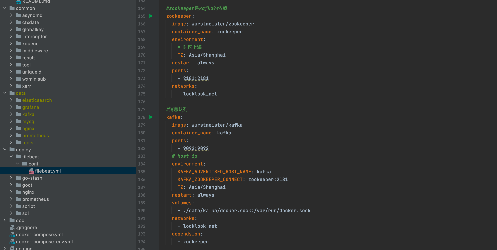
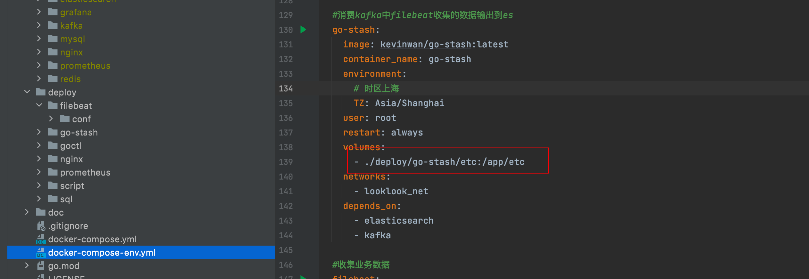

### 11、日志收集


在介绍之前，我先说一下整体思路，如果你的业务日志量不是特别大恰好你又使用的是云服务，那你直接使用云服务日志就可以了，比如阿里云的SLS，基本就是点点鼠标配置几步就可以将你的日志收集到阿里云的SLS里面了，直接就可以在阿里云中查看收集上来的日志了，感觉也没必要折腾。

如果你的日志量比较大，那就可以上日志系统了。


#### 1、日志系统

我们将业务日志打印到console、file之后，市面上比较常用的方式是elk、efk等基本思路一样，我们拿常说的elk来举例，基本思路就是logstash收集过滤到elasticsearch中，然后kibana呈现

但是logstash本身是使用java开发的，占用资源是真滴高，我们用go做业务，本身除了快就是占用资源少构建块，现在在搞个logstash浪费资源，那我们使用go-stash替代logstash，go-stash是go-zero官方自己开发的并且在线上经过长期大量实践的，但是它不负责收集日志，只负责过滤收集上来信息（https://github.com/kevwan/go-stash）


#### 2、架构方案


filebeat收集我们的业务日志，然后将日志输出到kafka中作为缓冲，go-stash获取kafka中日志根据配置过滤字段，然后将过滤后的字段输出到elasticsearch中，最后由kibana负责呈现日志


#### 3、实现方案

在上一节错误处理中，我们可以看到已经将我们想要的错误日志打印到了console控制台中了，现在我们只需要做后续收集即可

##### 3.1 kafka




先配置好kafka、zookeeper

然后我们进入kafka中先创建好filebeat收集日志到kafka的topic 

进入kafka容器

```shell
$  docker exec -it kafka /bin/sh
```

创建topic

```shell
$  cd /opt/kafka/bin
$ ./kafka-topics.sh --create --zookeeper zookeeper:2181 --replication-factor 1 -partitions 1 --topic looklook-log
```


##### 3.2 filebeat

在项目根目录下 docker-compose-env.yml文件中可以看到我们配置了filebeat


filebeat的配置我们挂载到 deploy/filebeat/conf/filebeat.yml

```yaml
filebeat.inputs:
  - type: log
    enabled: true
    paths:
      - /var/lib/docker/containers/*/*-json.log

filebeat.config:
  modules:
    path: ${path.config}/modules.d/*.yml
    reload.enabled: false

processors:
  - add_cloud_metadata: ~
  - add_docker_metadata: ~

output.kafka:
  enabled: true
  hosts: ["kafka:9092"]
  #要提前创建topic
  topic: "looklook-log"
  partition.hash:
    reachable_only: true
  compression: gzip
  max_message_bytes: 1000000
  required_acks: 1

```

配置比较简单，可以看到我们收集所有日志直接 输出到我们配置的kafka中 , topic配置上一步kafka中创建的topic即可


##### 3.3 配置go-stash



我们来看下go-stash的配置文件 deploy/go-stash/etc/config.yaml

```yaml
Clusters:
  - Input:
      Kafka:
        Name: gostash
        Brokers:
          - "kafka:9092"
        Topics:
          - looklook-log
        Group: pro
        Consumers: 16
    Filters:
      - Action: drop
        Conditions:
          - Key: k8s_container_name
            Value: "-rpc"
            Type: contains
          - Key: level
            Value: info
            Type: match
            Op: and
      - Action: remove_field
        Fields:
          # - message
          - _source
          - _type
          - _score
          - _id
          - "@version"
          - topic
          - index
          - beat
          - docker_container
          - offset
          - prospector
          - source
          - stream
          - "@metadata"
      - Action: transfer
        Field: message
        Target: data
    Output:
      ElasticSearch:
        Hosts:
          - "http://elasticsearch:9200"
        Index: "looklook-{{yyyy-MM-dd}}"
```

配置消费的kafka以及输出的elasticsearch ， 以及要过滤的字段等


##### 3.4 elastic search、kibana


访问kibana http://127.0.0.1:5601/ ， 创建日志索引

点击左上角菜单(三个横线那个东东)，找到Analytics - > 点击discover 


然后在当前页面，Create index pattern->输入looklook-*  -> Next Step ->选择@timestamp->Create index pattern

然后点击左上角菜单，找到Analytics->点击discover ，稍等一会，日志都显示了 （如果不显示，就去排查filebeat、go-stash，使用docker logs -f filebeat查看）


#### 4、结尾

到此日志收集就完成了，接下来我们要实现链路追踪


