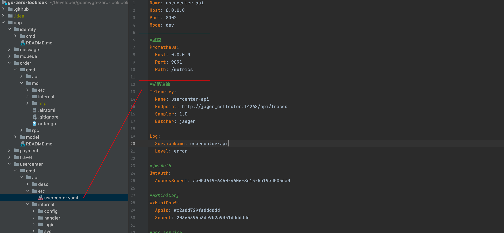
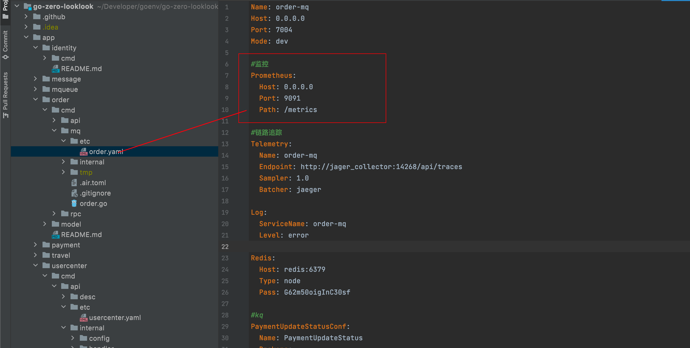
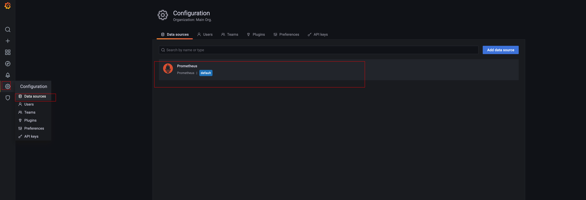
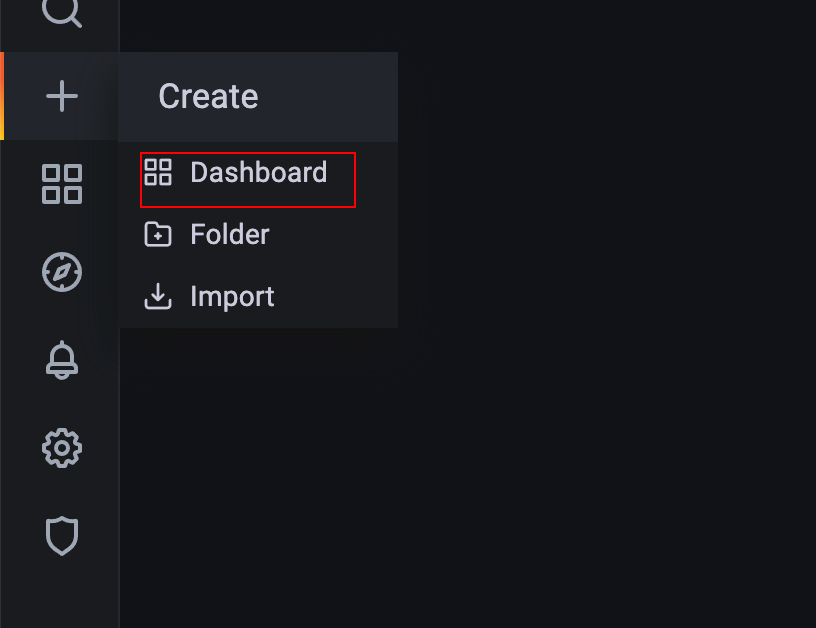
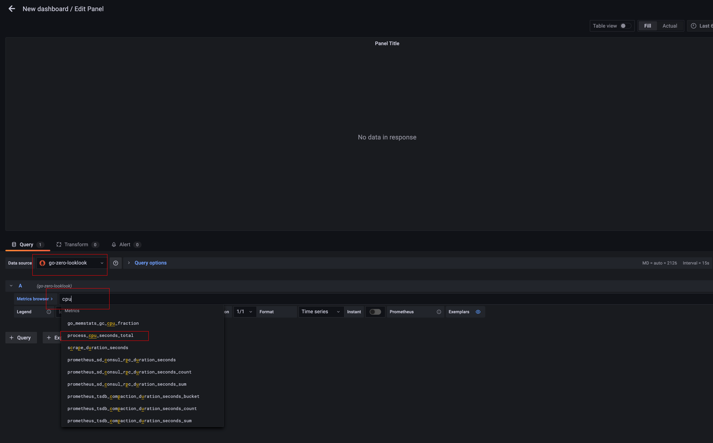

### 13、服务监控


#### 1、概述

好的服务一定是可以被及时监控的，在go-zero-looklook中我们使用目前比较流行的prometheus来作为监控工具，然后使用grafana来显示

go-zero已经在代码中给我们集成好了prometheus

```go
// StartAgent starts a prometheus agent.
func StartAgent(c Config) {
	if len(c.Host) == 0 {
		return
	}

	once.Do(func() {
		enabled.Set(true)
		threading.GoSafe(func() {
			http.Handle(c.Path, promhttp.Handler())
			addr := fmt.Sprintf("%s:%d", c.Host, c.Port)
			logx.Infof("Starting prometheus agent at %s", addr)
			if err := http.ListenAndServe(addr, nil); err != nil {
				logx.Error(err)
			}
		})
	})
}
```

无论当我们启动api、rpc都会额外启动一个goroutine 提供prometheus的服务

【注】如果像我们之前order-mq这种使用serviceGroup管理的服务，在启动文件main中要显示调用一下才可以，api、rpc不需要，配置都一样

```go
package main
.....
func main() {
	....
	// log、prometheus、trace、metricsUrl.
	if err := c.SetUp(); err != nil {
		panic(err)
	}

   ......
}

```


#### 2、实现

##### 2.1 配置prometheus与grafana

在项目下的docker-compose-env.yml文件中


我们来deploy/prometheus/server/prometheus.yml看看prometheus配置文件

```yaml
global:
  scrape_interval:
  external_labels:
    monitor: 'codelab-monitor'

# 这里表示抓取对象的配置
scrape_configs:
  - job_name: 'prometheus'
    scrape_interval: 5s  #重写了全局抓取间隔时间，由15秒重写成5秒
    static_configs:
      - targets: ['127.0.0.1:9090']

  - job_name: 'order-api'
    static_configs:
      - targets: ['order-api:9091']
        labels:
          job: order-api
          app: order-api
          env: dev
  - job_name: 'order-rpc'
    static_configs:
      - targets: ['order-rpc:9091']
        labels:
          job: order-rpc
          app: order-rpc
          env: dev
  - job_name: 'order-mq'
    static_configs:
      - targets: ['order-mq:9091']
        labels:
          job: order-mq
          app: order-mq
          env: dev
  - job_name: 'usercenter-api'
    static_configs:
      - targets: ['usercenter-api:9091']
        labels:
          job: usercenter-api
          app: usercenter-api
          env: dev
  - job_name: 'usercenter-rpc'
    static_configs:
      - targets: ['usercenter-rpc:9091']
        labels:
          job: usercenter-rpc
          app: usercenter-rpc
          env: dev
  - job_name: 'travel-api'
    static_configs:
      - targets: ['travel-api:9091']
        labels:
          job: travel-api
          app: travel-api
          env: dev
  - job_name: 'travel-rpc'
    static_configs:
      - targets: ['travel-rpc:9091']
        labels:
          job: travel-rpc
          app: travel-rpc
          env: dev
  - job_name: 'payment-api'
    static_configs:
      - targets: ['payment-api:9091']
        labels:
          job: payment-api
          app: payment-api
          env: dev
  - job_name: 'payment-rpc'
    static_configs:
      - targets: ['payment-rpc:9091']
        labels:
          job: payment-rpc
          app: payment-rpc
          env: dev
  - job_name: 'mqueue-rpc'
    static_configs:
      - targets: ['mqueue-rpc:9091']
        labels:
          job: mqueue-rpc
          app: mqueue-rpc
          env: dev
  - job_name: 'message-mq'
    static_configs:
      - targets: ['message-mq:9091']
        labels:
          job: message-mq
          app: message-mq
          env: dev
  - job_name: 'identity-api'
    static_configs:
      - targets: ['identity-api:9091']
        labels:
          job: identity-api
          app: identity-api
          env: dev
  - job_name: 'identity-rpc'
    static_configs:
      - targets: [ 'identity-rpc:9091' ]
        labels:
          job: identity-rpc
          app: identity-rpc
          env: dev
```


##### 2.2 业务配置

实现上我们业务也不需要添加任何代码（除了serviceGroup管理的服务）

我们只需要在业务配置文件中配置即可，我们拿usercenter来举例

1）api




2）rpc


3）mq（serviceGroup）



【注】（在强调一次）如果像我们之前order-mq这种使用serviceGroup管理的服务，在启动文件main中要显示调用一下才可以，api、rpc不需要

```go
package main
.....
func main() {
	....
	// log、prometheus、trace、metricsUrl.
	if err := c.SetUp(); err != nil {
		panic(err)
	}

   ......
}


```


##### 2.3 查看

访问 http://127.0.0.1:9090/ ， 点击上面菜单“Status”，在点击Targets ,蓝色的就是启动成了，红色就是没启动成功


##### 2.4 配置grafana

访问http://127.0.0.1:3001， 默认账号、密码都是admin


配置数据源是prometheus



然后配置


【注】这里是在docker中配置的，所以http的url不能写127.0.0.1


查看是否配置成功


配置dashboard




然后点击第一个


我们添加一个cpu指标，在下方输入cpu选择




然后我们就可以看到我们想要看的监控指标


#### 3、结尾

这里只演示了一个指标，其他想看的指标自己配置就可以了，同时你也可以在grafana添加alert报警配置，这个就不作为演示了自行整理


