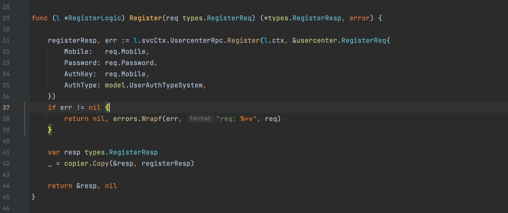
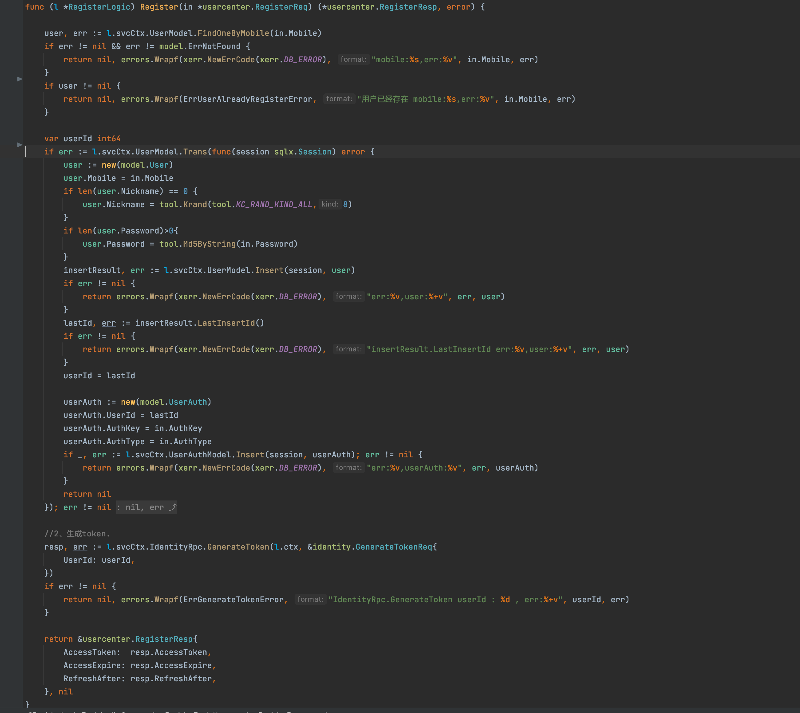
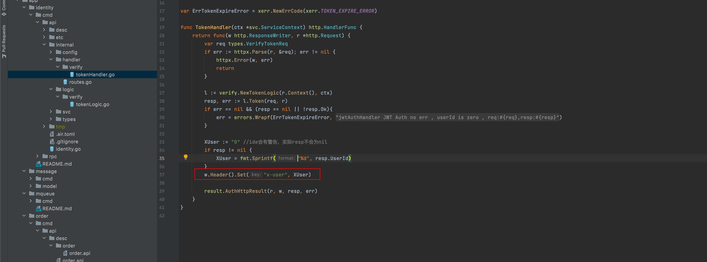
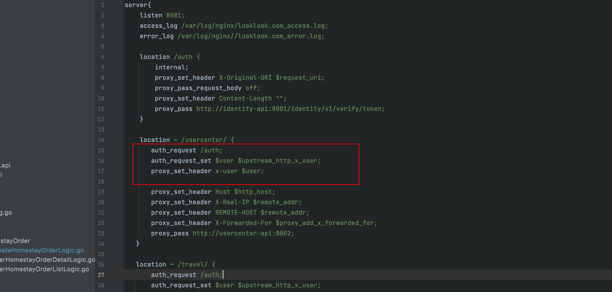
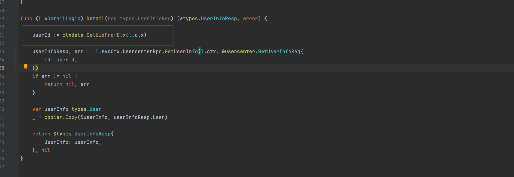
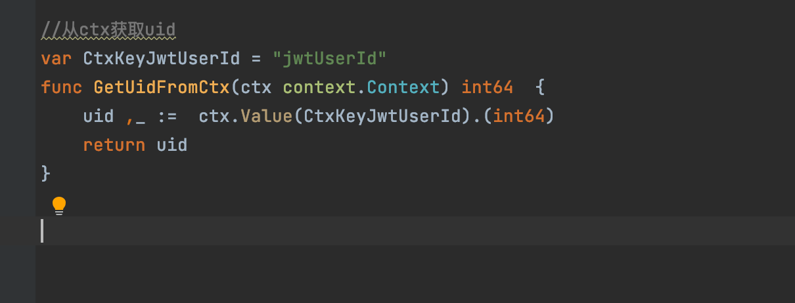
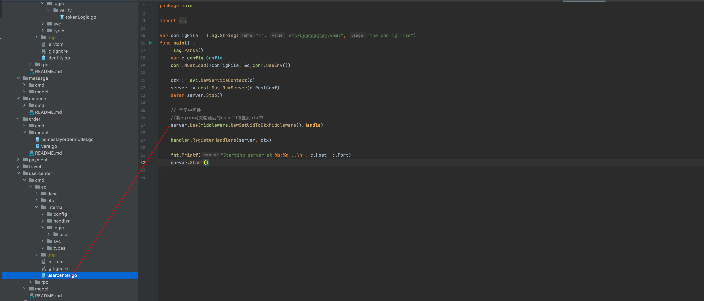
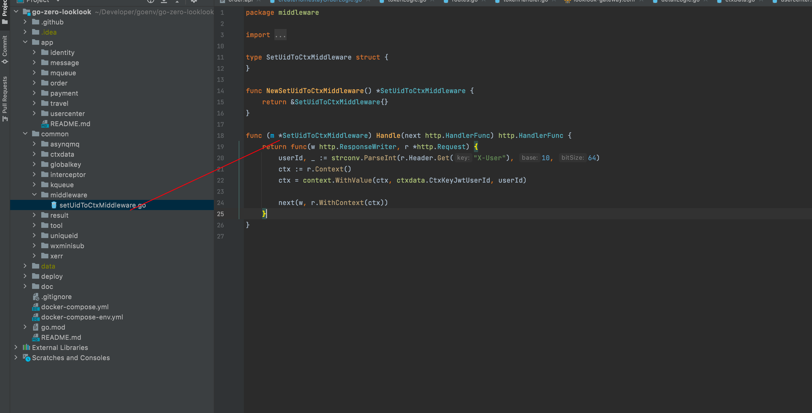

### 四、用户中心服务

本项目地址 :  https://github.com/Mikaelemmmm/go-zero-looklook


#### 1、用户中心业务架构图


#### 2、依赖关系

 usercenter-api（用户中心api） 依赖 identity-rpc（授权认证rpc）、usercenter-rpc（用户中心rpc）

 usercenter-rpc（用户中心rpc）依赖 identity-rpc（授权中心rpc）


我们看项目usercenter/cmd/api/desc/usercenter.api ，所有的用户api对外的http方法都在这里面

这里面有4个业务注册、登陆、获取用户信息、微信小程序授权


#### 3、注册来举例


##### 1、注册api服务

我们在写api服务代码的时候是先要在usercenter.api中定义好service中的方法，然后在desc/user中写request、response，这样拆分开的好处是不那么臃肿

1、在usercenter.api中定义注册方法如下

```go
//用户模块v1版本的接口
@server(
	prefix: usercenter/v1
	group: user
)
service usercenter {
  @doc "注册"
	@handler register
	post /user/register (RegisterReq) returns (RegisterResp)
  
  .....
}
```

2、在app/usercenter/cmd/api/desc/user/user.api中定义RegisterReq\RegisterResp

```go
type (
	RegisterReq {
		Mobile   string `json:"mobile"`
		Password string `json:"password"`
	}
	RegisterResp {
		AccessToken  string `json:"accessToken"`
		AccessExpire int64  `json:"accessExpire"`
		RefreshAfter int64  `json:"refreshAfter"`
	}
)
```

3、goctl生成api代码

1）命令行进入app/usercenter/cmd/api/desc目录下。

2）去项目目录下deploy/script/gencode/gen.sh中，复制如下一条命令，在命令行中执行（命令行要切换到app/usercenter/cmd/api/desc目录）

```shell
$ goctl api go -api *.api -dir ../  -style=goZero
```

4、打开app/usercenter/cmd/api/internal/logic/user/register.go文件




这里就很容易了，直接调用user的rpc服务即可

这里有个小技巧，很多同学感觉rpc服务返回的字段跟api定义差不多，每次都要手动去复制很麻烦，那么go有没有像java一样的BeanCopyUtils.copy 这种工具呢？答案肯定是有的，可以看上面的代码copier.Copy ，这个库是gorm作者的另一款新作，是不是很兴奋。 那我们继续看看调用后端的rpc是什么样子的。


##### 2、注册rpc服务

- 定义protobuf文件

  我们在app/usercenter/cmd/rpc/pb中新建usercenter.proto，写入注册方法

  ```protobuf
  //req 、resp
  message RegisterReq {
    string mobile = 1;
    string nickname = 2;
    string password = 3;
    string authKey = 4;
    string authType = 5;
  }
  message RegisterResp {
    string accessToken = 1;
    int64  accessExpire = 2;
    int64  refreshAfter = 3;
  }
  
  //service
  service usercenter {
    rpc register(RegisterReq) returns(RegisterResp);
    ......
  }
  ```

  

- 使用goctl生成代码，这里不需要自己手动敲

  1）命令行进入app/usercenter/cmd/rpc/pb目录下。

  2）去项目目录下deploy/script/gencode/gen.sh中，复制如下两条命令，在命令行中执行（命令行要切换到app/usercenter/cmd/rpc/pb目录）

  ```shell
  $  goctl rpc protoc *.proto --go_out=../ --go-grpc_out=../  --zrpc_out=../
  $  sed -i "" 's/,omitempty//g' *.pb.go
  ```

- 打开app/usercenter/cmd/rpc/internal/logic/registerLogic.go写逻辑代码

  

  

  注册设计到2张表，一个user表，一个user_auth表，user是存储用户基本信息的，user_auth是可以根据不同平台授权登陆的相关信息，所以这里设计到本地事务，由于go-zero的事务要在model中才能使用，但是我在model中做了个处理，把它在model中暴露出来，就可以在logic中使用

  model中定义了Trans方法暴露事务给logic

  

  在logic中直接使用

  

  由于项目支持小程序、手机号，小程序注册不需要密码，所以在处理密码时候做了个处理，手机号注册就要传递密码，小程序注册就不需要传递密码，至于手机号注册密码不能为空要在手机号注册时候的api服务自己判断

  

  ​	
  
  在usercenter-rpc注册成功之后，需要请求token给前端登陆，直接请求identity-rpc颁发该用户的token
  
  
  
  
  
  identity-rpc中如下
  
  ```protobuf
  message GenerateTokenReq {
    int64 userId = 1;
  }
  message GenerateTokenResp {
    string accessToken = 1;
    int64  accessExpire = 2;
    int64  refreshAfter = 3;
  }
  
  
  service identity{
    //生成token，只针对用户服务开放访问
    rpc generateToken(GenerateTokenReq) returns(GenerateTokenResp);
    .....
  }
  ```
  
  generatetokenlogic.go
  
  ```go
  // GenerateToken 生成token，只针对用户服务开放访问.
  func (l *GenerateTokenLogic) GenerateToken(in *pb.GenerateTokenReq) (*pb.GenerateTokenResp, error) {
  
  	now := time.Now().Unix()
  	accessExpire := l.svcCtx.Config.JwtAuth.AccessExpire
  	accessToken, err := l.getJwtToken(l.svcCtx.Config.JwtAuth.AccessSecret, now, accessExpire, in.UserId)
  	if err != nil {
  		return nil, errors.Wrapf(ErrGenerateTokenError, "getJwtToken err userId:%d , err:%v", in.UserId, err)
  	}
  
  	//存入redis
  	userTokenKey := fmt.Sprintf(globalkey.CacheUserTokenKey, in.UserId)
  	err = l.svcCtx.RedisClient.Setex(userTokenKey, accessToken, int(accessExpire))
  	if err != nil {
  		return nil, errors.Wrapf(ErrGenerateTokenError, "SetnxEx err userId:%d, err:%v", in.UserId, err)
  	}
  
  	return &pb.GenerateTokenResp{
  		AccessToken:  accessToken,
  		AccessExpire: now + accessExpire,
  		RefreshAfter: now + accessExpire/2,
  	}, nil
  }
  ```
  
  注册成功并去identity-rpc拿到token、token过期时间、置换token的时间给api服务


#### 4、业务获取登陆用户id

当我们在获取用户信息，或者下单等场景下总要获取登陆用户的id，前一篇我们讲到，我们在授权identity服务中校验完token，解析出来的userId会放到header中返回给nginx的authReuest

在文件app/identity/cmd/api/internal/handler/verify/tokenHandler.go



nginx通过authRequest然后访问后端的服务时候，会把header内容传递给后端服务，因为我们在nginx中配置了如下



那这样的话，我们在后端服务就可以拿到这个userId了，比如我们现在访问usercenter/v1/user/detail获取当前登陆用户信息



ok，可以看到我们通过 ctxdata.GetUidFromCtx(l.ctx)就可以拿到，为什么这么神奇呢？我们点开看看这个方法



实际上就是从ctx中拿到的userId，是不是很奇怪，我们明明在nignx就放在了header中，你在go的业务代码中为什么能通过ctx拿到？

##### 1、【小技巧】middleware

当nginx在header中携带了x-user就是userId来访问后端服务的时候，我们后端服务在启动时main函数会加载一个全局中间件，比如usercenter-api中的main

app/usercenter/cmd/api/usercenter.go



这里定义了全局中间件，只要有请求到我们usercenter-ap某个方法之前，都会先进入全局中间件中，中间件具体内容如下



所以是不是一下就明白了，在请求我们usercenter/v1/user/detail时候，会先进入这个中间件，在这个中间件内，我们通过nginx的header中的X-User拿到解析后的userId放到ctx中，那继续进入到usercenter/v1/user/detail时候，我们是不是就可以通过ctx直接取出来在业务中用啦，一切真相大白。


同样其他用户中心服务登陆、获取登陆用户信息、小程序授权登陆都是一个道理，这里就不再啰嗦了，自行看代码即可

【注】小程序授权登陆，记得修改配置文件，这里的配置文件是假的，改成自己的


