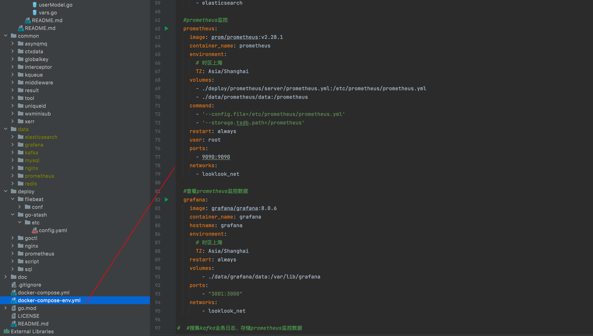
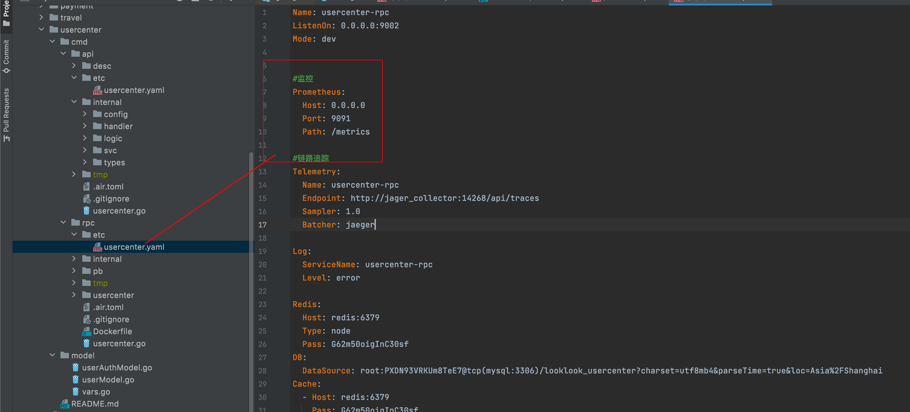
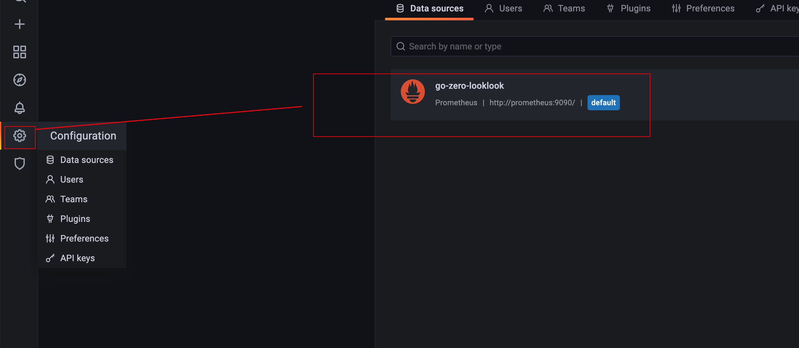

- [XIII. Service monitoring](#xiii-service-monitoring)
  - [1. Overview](#1-overview)
  - [2. Implementation](#2-implementation)
    - [2.1. Configure prometheus with grafana](#21-configure-prometheus-with-grafana)
    - [2.2. Business configuration](#22-business-configuration)
    - [2.3. View](#23-view)
    - [2.4. Configuring grafana](#24-configuring-grafana)
  - [3. Ending](#3-ending)

# XIII. Service monitoring

## 1. Overview

A good service must be able to be monitored in time, in go-zero-looklook we use the currently popular prometheus as a monitoring tool, and then use grafana to show

go-zero has integrated prometheus in the code for us

```go
// StartAgent starts a prometheus agent.
func StartAgent(c Config) {
 if len(c.Host) == 0 {
  return
 }

 once.Do(func() {
  enabled.Set(true)
  threading.GoSafe(func() {
   http.Handle(c.Path, promhttp.Handler())
   addr := fmt.Sprintf("%s:%d", c.Host, c.Port)
   logx.Infof("Starting prometheus agent at %s", addr)
   if err := http.ListenAndServe(addr, nil); err != nil {
    logx.Error(err)
   }
  })
 })
}
```

Whenever we start api, rpc will start an additional goroutine to provide prometheus services

Note] If we use serviceGroup management services like order-mq, we need to show the call in the startup file main to be able to do it, api, rpc do not need to, the configuration is the same

```go
package main
.....
func main() {
 ....
 // log.prometheus.trace.metricsUrl.
 if err := c.SetUp(); err != nil {
  panic(err)
 }

   ......
}

```

## 2. Implementation

### 2.1. Configure prometheus with grafana

In the docker-compose-env.yml file under the project



Let's deploy/prometheus/server/prometheus.yml to see the prometheus configuration file

```yaml
global:
  scrape_interval:
  external_labels:
    monitor: 'codelab-monitor'

 Here indicates the configuration of the crawl object
scrape_configs:
  - job_name: 'prometheus'
    scrape_interval: 5s  # Rewrote the global grab interval from 15 seconds to 5 seconds
    static_configs:
      - targets: ['127.0.0.1:9090']

  - job_name: 'banner-rpc'
    static_configs:
      - targets: [ 'looklook:3001' ]
        labels:
          job: banner-rpc
          app: banner-rpc
          env: dev
  - job_name: 'order-api'
    static_configs:
      - targets: ['looklook:3002']
        labels:
          job: order-api
          app: order-api
          env: dev
  - job_name: 'order-rpc'
    static_configs:
      - targets: ['looklook:3003']
        labels:
          job: order-rpc
          app: order-rpc
          env: dev
  - job_name: 'order-mq'
    static_configs:
      - targets: ['looklook:3004']
        labels:
          job: order-mq
          app: order-mq
          env: dev
  - job_name: 'usercenter-api'
    static_configs:
      - targets: ['looklook:3005']
        labels:
          job: usercenter-api
          app: usercenter-api
          env: dev
  - job_name: 'usercenter-rpc'
    static_configs:
      - targets: ['looklook:3006']
        labels:
          job: usercenter-rpc
          app: usercenter-rpc
          env: dev
  - job_name: 'travel-api'
    static_configs:
      - targets: ['looklook:3007']
        labels:
          job: travel-api
          app: travel-api
          env: dev
  - job_name: 'travel-rpc'
    static_configs:
      - targets: ['looklook:3008']
        labels:
          job: travel-rpc
          app: travel-rpc
          env: dev
  - job_name: 'payment-api'
    static_configs:
      - targets: ['looklook:3009']
        labels:
          job: payment-api
          app: payment-api
          env: dev
  - job_name: 'payment-rpc'
    static_configs:
      - targets: ['looklook:3010']
        labels:
          job: payment-rpc
          app: payment-rpc
          env: dev
  - job_name: 'mqueue-rpc'
    static_configs:
      - targets: ['looklook:3011']
        labels:
          job: mqueue-rpc
          app: mqueue-rpc
          env: dev
  - job_name: 'message-mq'
    static_configs:
      - targets: ['looklook:3012']
        labels:
          job: message-mq
          app: message-mq
          env: dev
  - job_name: 'identity-api'
    static_configs:
      - targets: ['looklook:3013']
        labels:
          job: identity-api
          app: identity-api
          env: dev
  - job_name: 'identity-rpc'
    static_configs:
      - targets: [ 'looklook:3014' ]
        labels:
          job: identity-rpc
          app: identity-rpc
          env: dev
  - job_name: 'admin-api'
    static_configs:
      - targets: [ 'admin-api:3015' ]
        labels:
          job: identity-rpc
          app: identity-rpc
          env: dev

```

### 2.2. Business configuration

The implementation of our business also does not need to add any code (except for the serviceGroup managed services)

We just need to configure it in the business configuration file, let's take usercenter as an example

1) api


2）rpc



3）mq（serviceGroup）


Note] (In emphasize once) If we use serviceGroup management services like order-mq before, in the startup file main to show a call to be able to, api, rpc do not need

```go
package main
.....
func main() {
 ....
 // log.prometheus.trace.metricsUrl.
 if err := c.SetUp(); err != nil {
  panic(err)
 }

   ......
}


```

### 2.3. View

Visit <http://127.0.0.1:9090/>, click "Status" on the menu above, and click Targets, blue means it has been started, red means it has not been started successfully.


### 2.4. Configuring grafana

Access <http://127.0.0.1:3001>, the default account and password are admin


The configuration data source is prometheus


Then configure


Note] Here is the configuration in docker, so the http url can not write 127.0.0.1

Check if the configuration is successful



Configuring the dashboard


Then click on the first


We add a cpu indicator, enter cpu selection below


Then we can see the monitoring indicators we want to see


## 3. Ending

Here is only a demonstration of the indicators, other indicators you want to see their own configuration can be, while you can also add alert alarm configuration in grafana, this will not be used as a demonstration of their own finishing
