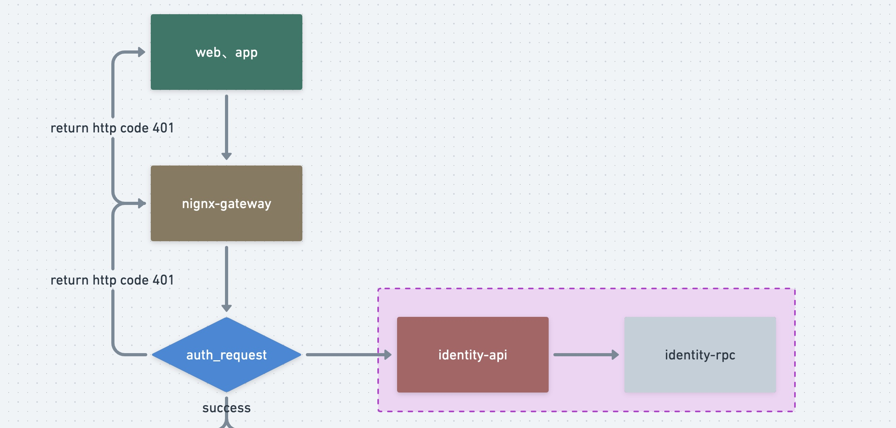
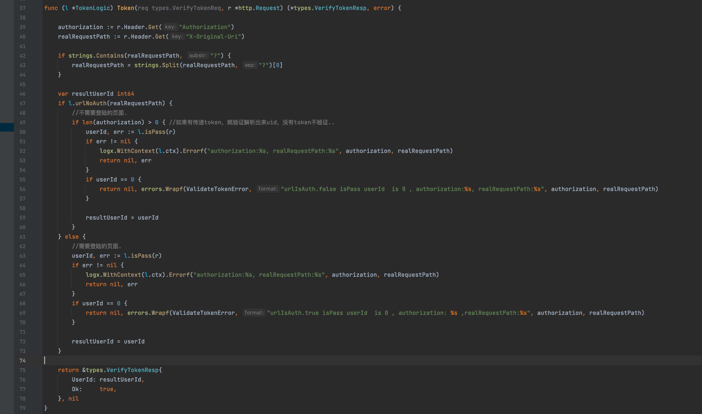
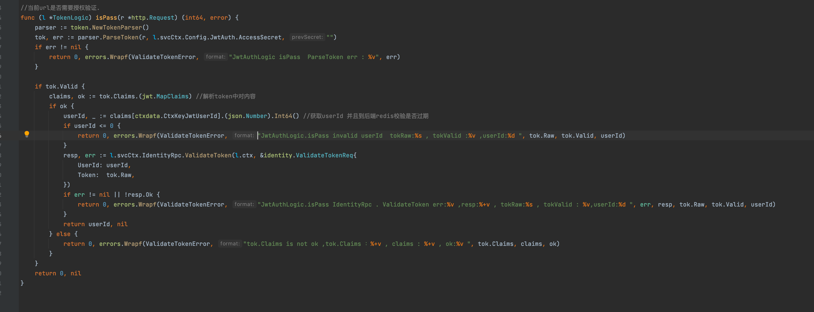

### 三、Authentication Services

Address of this project :  https://github.com/Mikaelemmmm/go-zero-looklook


#### 1、Forensic services




#### 1.1 identity-api

identity is mainly used for authentication services, as mentioned earlier in our nginx gateway. When accessing a resource, nginx internal will first come to identity-api to resolve the token, identity-api will go to request identity-rpc, all the verification and issuance of token, unified is done in identity-rpc




We will get the token from the Authorization of the header and the path to the accessed resource from the x-Original-Uri

- If the currently accessed route requires login:

  - token parsing failure: it will return to the front-end http401 error code；

  - The token is parsed successfully: the parsed userId will be put into the x-user of the header and returned to the auth module, which will pass the header to the corresponding service (usercenter), so that we can get the login user's id directly in usercenter

- If the currently accessed route does not require a login.

  - The token is passed in the front-end header
    - If the token checksum fails: return http401.
    - If the token verification is successful: the parsed userId will be put into the x-user of the header and returned to the auth module, which will pass the header to the corresponding service (usercenter), so that we can get the login user's id directly in usercenter

  - No token passed in the front header: userid will pass 0 to the back-end service


The urlNoAuth method determines whether the current resource is configured in yml to not log in

```go
// Does the current url require authorization verification
func (l *TokenLogic) urlNoAuth(path string) bool {
   for _, val := range l.svcCtx.Config.NoAuthUrls {
      if val == path {
         return true
      }
   }
   return false
}
```


isPass method is to identity-rpc check token, mainly is also used go-zero jwt's method




#### 1.2 identity-rpc

When we register and login successfully, the user service will call identity-rpc to generate a token, so we unify in identity-rpc to issue and verify the token, so that each service does not have to write a jwt to maintain.

When the identity-api request comes in, identity-api itself can resolve the userid, but we want to check whether the token is expired, we have to go to the back-end rpc in the redis to carry out the second verification (of course, if you think here more than one request, you can put this step in the api directly request redis also can be), after the rpc validateToken method verification

```protobuf
message ValidateTokenReq {
  int64 userId = 1;
  string token = 2;
}
message ValidateTokenResp {
  bool ok = 1;
}

rpc validateToken(ValidateTokenReq) returns(ValidateTokenResp);
```

Verify that the token issued out of redis during previous logins, registrations, and other authorizations is correct and expired.


So that api can return to nginx auth module whether failure, if failure auth will be returned directly to the front-end http code 401 (so your front-end should be the first to determine the http status code > = 400 all exceptions, in the judgment of the business error code) , if successful direct access to the back-end services to get data directly back to the front-end display


#### 2、install goctl 、 protoc、protoc-gen-go

Note] This has nothing to do with forensics, just write the code to be used later, here it is best to install the

1、install goctl

```shell
# for Go 1.15 and earlier
GO111MODULE=on go get -u github.com/zeromicro/go-zero/tools/goctl@latest

# for Go 1.16 and later
go install github.com/zeromicro/go-zero/tools/goctl@latest
```

Verify successful installation

```shell
$ goctl --version
```

Goctl custom template template: copy the contents of the data/goctl folder in the project directory to the .goctl in the home directory, goctl will give priority to the contents of this template when generating code

```shell
$ cp -r data/goctl ~/.goctl
```


2、Install protoc

Link: https://github.com/protocolbuffers/protobuf/releases

Directly find the corresponding platform protoc, I am mac intel chip, so directly find the protoc-3.19.3-osx-x86_64.zip, extract it and go to the bin directory under that directory, copy the protoc directly to your gopath/bin directory.

Verify that the installation is successful

```shell
$ protoc --version
```


3、install protoc-gen-go

```shell
$ go install google.golang.org/protobuf/cmd/protoc-gen-go@latest 
```

Just check if there is protoc-gen-go under $GOPATH/bin

Note】：If you encounter the following problems when using goctl to generate code

```shell
protoc  --proto_path=/Users/seven/Developer/goenv/go-zero-looklook/app/usercenter/cmd/rpc/pb usercenter.proto --go_out=plugins=grpc:/Users/seven/Developer/goenv/go-zero-looklook/app/usercenter/cmd/rpc --go_opt=Musercenter.proto=././pb
goctl: generation error: unsupported plugin protoc-gen-go which installed from the following source:
google.golang.org/protobuf/cmd/protoc-gen-go, 
github.com/protocolbuffers/protobuf-go/cmd/protoc-gen-go;

Please replace it by the following command, we recommend to use version before v1.3.5:
go get -u github.com/golang/protobuf/protoc-gen-go
goctl version: 1.3.0 darwin/amd64
```

Direct execution 

```shell
$ go get -u github.com/golang/protobuf/protoc-gen-go
```


4、install protoc-gen-go-grpc

```shell
$ go install google.golang.org/grpc/cmd/protoc-gen-go-grpc@latest
```


### 3、Summary

In general, identity is quite simple. The whole process is as follows.

user initiates a request for resources -> nginx gateway -> match to the corresponding service module -> auth module -> identity-api -> identity-rpc -> user requested resources


